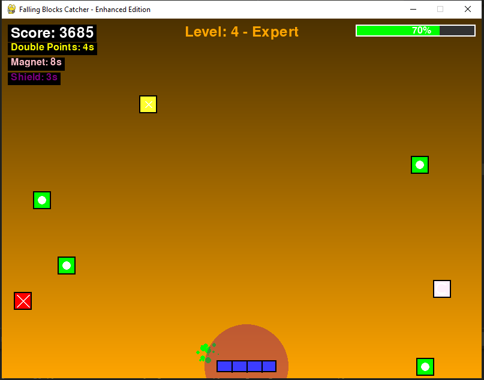

# 🎮 Falling Blocks Catcher - Enhanced Edition

A colorful 2D **arcade-style game** built with Python and [Pygame](https://www.pygame.org/).  
Catch the good blocks, avoid the bad ones, grab power-ups, and climb through levels while racking up the highest score you can!

---

## 🚀 Features
- 🧺 **Basket Control**: Move left and right to catch blocks.
- 🎨 **Visual Effects**: Gradient backgrounds, glowing particles, shield pulses, and animated blocks.
- 🟩 **Block Types**:
  - Good blocks (+10 points)
  - Bad blocks (-10 points, health damage)
  - Special blocks (+20 points, heal 5%)
  - Bonus blocks (+50 points, heal 10%)
  - Bombs (-30 points, heavy damage)
- ⚡ **Power-Ups**:
  - Slow Motion (slows falling blocks)
  - Double Points (doubles score gain)
  - Magnet (attracts nearby blocks)
  - Shield (protects against harmful blocks)
- 📈 **Level System**:
  Levels unlock as you score more points. Each level increases difficulty and changes the background color.
- 🔊 **Sound Effects**: Catch, damage, power-up, and level-up (with silent fallback if sound files not available).
- 🛑 **Pause & Resume**: Press `P` anytime to pause/unpause.
- 💀 **Game Over Screen**: Displays final score, high score, and level reached. Press `R` to restart or `Q` to quit.

---

## 🎮 Controls
- **Arrow Keys** → Move basket left/right
- **P** → Pause/Resume
- **R** → Restart (on game over screen)
- **Q** → Quit (in pause menu or game over screen)

---

## 🛠️ Installation

1. Install [Python 3.10+](https://www.python.org/downloads/).
2. Install dependencies:
   ```bash
   pip install pygame numpy
   ```
3. Clone this repository:
   ```bash
   git clone https://github.com/yourusername/falling-blocks-catcher.git
   cd falling-blocks-catcher
   ```
4. Run the game:
   ```bash
   python game.py
   ```

---

## 📂 Project Structure

```
falling-blocks-catcher/
│── main.py         # Main game file
│── catch.wav       # (optional) Sound effect for catching blocks
│── damage.wav      # (optional) Sound effect for damage
│── powerup.wav     # (optional) Sound effect for power-ups
│── level_up.wav    # (optional) Sound effect for level up
│── README.md       # Game instructions & info
```

> If sound files are missing, the game will still run with silent placeholder sounds.

---

## 🌟 Future Ideas

- Add a main menu and settings screen.
- Add new power-ups (time freeze, extra life, shrink basket).
- Online leaderboard for high scores.
- Skins for basket and blocks.

---

## 📸 Screenshots

**Gameplay Example:**  


---

## 🧑‍💻 Author

Built with ❤️ using **Python** and **Pygame**.

---

Enjoy catching blocks, leveling up, and chasing that high score!